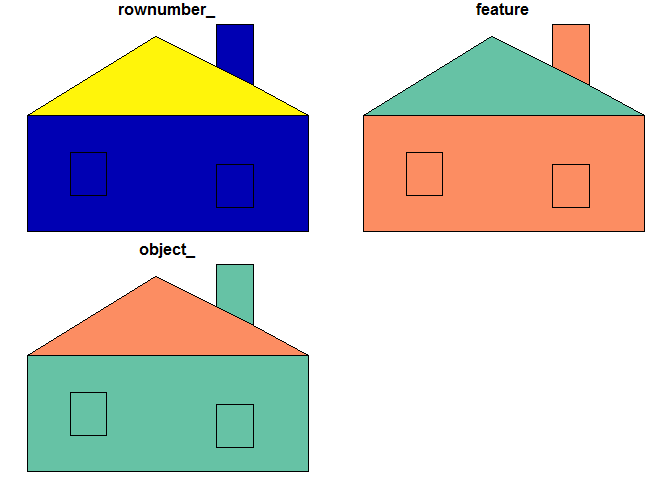

<!-- README.md is generated from README.Rmd. Please edit that file -->
scdb
====

The goal of scdb is to provide a back-end for the `sc` project.

This is a general common-form data structure for complex hierarchical data.

Installation
------------

You can install scdb from github with:

``` r
# install.packages("devtools")
devtools::install_github("mdsumner/scdb")
```

Example
-------

This is a basic example which converts a simple features object to generic form, writes it to a database, then recreates that object from the database. This is done in a very generic and flexible way, and is both scaleable and extensible.

``` r

library(scdb)
data(hpoly)
(pdb <- write_db(hpoly))
#> decomposing object
#> write tables to database C:\Users\mdsumner\AppData\Local\Temp\RtmpaQ9ZHw\file1f189b17246.sqlite
#> src:  sqlite 3.11.1 [C:\Users\mdsumner\AppData\Local\Temp\RtmpaQ9ZHw\file1f189b17246.sqlite]
#> tbls: branch, branch_link_vertex, object, sqlite_stat1, vertex
```

Now explore the objects available in the database.

``` r
library(dplyr)
#> 
#> Attaching package: 'dplyr'
#> The following objects are masked from 'package:stats':
#> 
#>     filter, lag
#> The following objects are masked from 'package:base':
#> 
#>     intersect, setdiff, setequal, union
(obj <- tbl(pdb, "object"))
#> Source:   query [?? x 3]
#> Database: sqlite 3.11.1 [C:\Users\mdsumner\AppData\Local\Temp\RtmpaQ9ZHw\file1f189b17246.sqlite]
#> 
#>   rownumber_ feature          object_
#>        <int>   <chr>            <chr>
#> 1          1    wall 1a628889af4fac31
#> 2          2    roof 29c74f0ef9523505
#> 3          3    door 47de1edaeceed757
```

There are three objects, and each has a long ID in the column `object_`, as well as other metadata.

Using queries, including joins we can access the other data in the decomposed tables. There is a straightforward chain of IDs between tables for this model, they are `object_`, `branch_`, `vertex_`. This chain can be used for predictable join expansion to access the coordinates for branches or objects.

``` r
big_tab <- (obj %>% inner_join(tbl(pdb, "branch")) %>% inner_join(tbl(pdb, "branch_link_vertex")) %>% inner_join(tbl(pdb, "vertex")))
#> Joining, by = "object_"
#> Joining, by = "branch_"
#> Joining, by = "vertex_"
big_tab %>% arrange(branch_, order_)
#> Source:   query [?? x 10]
#> Database: sqlite 3.11.1 [C:\Users\mdsumner\AppData\Local\Temp\RtmpaQ9ZHw\file1f189b17246.sqlite]
#> 
#>    rownumber_ feature          object_ island_ ncoords_          branch_
#>         <int>   <chr>            <chr>   <chr>    <int>            <chr>
#> 1           1    wall 1a628889af4fac31       2        7 35e38fb29c35c211
#> 2           1    wall 1a628889af4fac31       2        7 35e38fb29c35c211
#> 3           1    wall 1a628889af4fac31       2        7 35e38fb29c35c211
#> 4           1    wall 1a628889af4fac31       2        7 35e38fb29c35c211
#> 5           1    wall 1a628889af4fac31       2        7 35e38fb29c35c211
#> 6           1    wall 1a628889af4fac31       2        7 35e38fb29c35c211
#> 7           1    wall 1a628889af4fac31       2        7 35e38fb29c35c211
#> 8           1    wall 1a628889af4fac31       1        5 4aecfa46c49e5bdc
#> 9           1    wall 1a628889af4fac31       1        5 4aecfa46c49e5bdc
#> 10          1    wall 1a628889af4fac31       1        5 4aecfa46c49e5bdc
#> # ... with more rows, and 4 more variables: order_ <int>, vertex_ <chr>,
#> #   x_ <dbl>, y_ <dbl>
```

In a real case we would wrap the chained joins within a list-column in `obj` or similar trick, and use the database more cleverly to only expand out the data we need for each object. But also note there's no `collect` statement, `big_tab` is still a promise that the database will do the work only when we really need it to.

For demonstration, show that we can recompose the hierarchical object.

Extract a subset of the features, in this case the wall and the roof, but not the door. We don't yet 'collect' these data because we need to keep the live link for efficient extraction.

``` r
(o <- obj %>% filter(feature %in% c("wall", "roof"))) ##%>% collect())
#> Source:   query [?? x 3]
#> Database: sqlite 3.11.1 [C:\Users\mdsumner\AppData\Local\Temp\RtmpaQ9ZHw\file1f189b17246.sqlite]
#> 
#>   rownumber_ feature          object_
#>        <int>   <chr>            <chr>
#> 1          1    wall 1a628889af4fac31
#> 2          2    roof 29c74f0ef9523505
```

Now we need the geometries.

``` r
o %>%  select(object_) %>% dplyr::inner_join(tbl(pdb, "branch"))
#> Joining, by = "object_"
#> Source:   query [?? x 4]
#> Database: sqlite 3.11.1 [C:\Users\mdsumner\AppData\Local\Temp\RtmpaQ9ZHw\file1f189b17246.sqlite]
#> 
#>            object_ island_ ncoords_          branch_
#>              <chr>   <chr>    <int>            <chr>
#> 1 1a628889af4fac31       1        5 b51f4b5d1773afb3
#> 2 1a628889af4fac31       1        5 d6524c3284edf1d1
#> 3 1a628889af4fac31       1        5 4aecfa46c49e5bdc
#> 4 1a628889af4fac31       1        5 e074f005e62f652c
#> 5 1a628889af4fac31       2        7 35e38fb29c35c211
#> 6 1a628889af4fac31       3        5 522e0a4eb4cf2ddd
#> 7 29c74f0ef9523505       1        6 b5a0979667906a93
```

A simple way is to expand out the entire coordinate table, then process it into the right simple features.

``` r
coords <- o %>%  select(object_) %>% dplyr::inner_join(tbl(pdb, "branch")) %>% 
  inner_join(tbl(pdb, "branch_link_vertex")) %>% arrange(object_, island_, order_) %>% 
  select(-ncoords_, 
         -order_) %>% 
  inner_join(tbl(pdb, "vertex")) %>% select(-vertex_) %>% 
  collect()
#> Joining, by = "object_"
#> Joining, by = "branch_"
#> Joining, by = "vertex_"

library(sf)
#> Linking to GEOS 3.5.0, GDAL 2.1.1, proj.4 4.9.3
rt <- st_sf(collect(o), geometry = st_sfc(lapply(split(coords, coords$object_), function(x) st_multipolygon(lapply(split(x, x$branch_), function(y) lapply(split(y, y$island_), function(b) as.matrix(b[c(seq_len(nrow(b)), 1), c("x_", "y_")])))))))

rt
#> Simple feature collection with 2 features and 3 fields
#> geometry type:  MULTIPOLYGON
#> dimension:      XY
#> bbox:           xmin: 0 ymin: 0 xmax: 46 ymax: 34
#> epsg (SRID):    NA
#> proj4string:    NA
#>   rownumber_ feature          object_                       geometry
#> 1          1    wall 1a628889af4fac31 MULTIPOLYGON(((18.6 7.69999...
#> 2          2    roof 29c74f0ef9523505 MULTIPOLYGON(((21 32, 31 27...

plot(rt)
```


