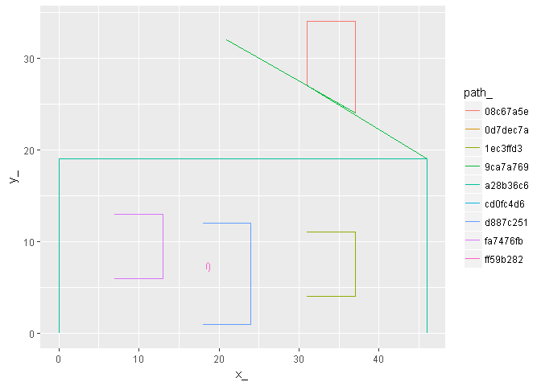
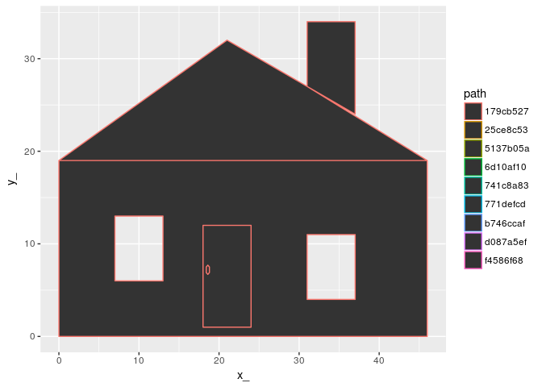

<!-- README.md is generated from README.Rmd. Please edit that file -->
[](https://travis-ci.org/hypertidy/scdb) [](https://ci.appveyor.com/project/hypertidy/scdb) [](https://codecov.io/github/hypertidy/scdb?branch=master)

scdb
====

The goal of scdb is to provide a back-end for the sc project.

This is a general common-form data structure for complex hierarchical data.

Installation
------------

You can install scdb from github with:

``` r
# install.packages("devtools")
devtools::install_github("hypertidy/scdb")
```

Example
-------

This is a basic example which converts a simple features object to a database, then recreates that object in a very scaleable, flexible and extensible way.

``` r

library(scdb)

data(hpoly)
(pdb <- write_db(hpoly))
#> creating temp database /tmp/RtmpvzMT8z/file4d464668cf80.sqlite
#> src:  sqlite 3.19.3 [/tmp/RtmpvzMT8z/file4d464668cf80.sqlite]
#> tbls: object, path, path_link_vertex, sqlite_stat1, sqlite_stat4, vertex
```

Now explore the objects available in the database.

``` r
library(dplyr)
#> 
#> Attaching package: 'dplyr'
#> The following objects are masked from 'package:stats':
#> 
#>     filter, lag
#> The following objects are masked from 'package:base':
#> 
#>     intersect, setdiff, setequal, union
(obj <- tbl(pdb, "object"))
#> # Source:   table<object> [?? x 3]
#> # Database: sqlite 3.19.3 [/tmp/RtmpvzMT8z/file4d464668cf80.sqlite]
#>   rownumber_ feature   object
#>        <int>   <chr>    <chr>
#> 1          1    wall c7a89f5d
#> 2          2    roof 5d7fac76
#> 3          3    door bfc0c8a7
```

There are three objects, and each has a long ID `object_`, as well as other metadata.

Using joins we can access the other data in the decomposed tables.

``` r
(p <- tbl(pdb, "vertex") %>% inner_join(tbl(pdb, "path_link_vertex")) %>% inner_join(tbl(pdb, "path"))) 
#> Joining, by = "vertex_"
#> Joining, by = "path"
#> # Source:   lazy query [?? x 9]
#> # Database: sqlite 3.19.3 [/tmp/RtmpvzMT8z/file4d464668cf80.sqlite]
#>       x_    y_  vertex_     path  ncol         type subobject   object
#>    <dbl> <dbl>    <chr>    <chr> <int>        <chr>     <int>    <chr>
#>  1     0     0 070545f9 5137b05a     2 MULTIPOLYGON         1 c7a89f5d
#>  2     0     0 070545f9 5137b05a     2 MULTIPOLYGON         1 c7a89f5d
#>  3     0    19 db22df3a 5137b05a     2 MULTIPOLYGON         1 c7a89f5d
#>  4     0    19 db22df3a 25ce8c53     2 MULTIPOLYGON         1 5d7fac76
#>  5     0    19 db22df3a 25ce8c53     2 MULTIPOLYGON         1 5d7fac76
#>  6    46    19 58b329c7 5137b05a     2 MULTIPOLYGON         1 c7a89f5d
#>  7    46    19 58b329c7 25ce8c53     2 MULTIPOLYGON         1 5d7fac76
#>  8    46     0 e122ca56 5137b05a     2 MULTIPOLYGON         1 c7a89f5d
#>  9     7     6 bfe07f02 d087a5ef     2 MULTIPOLYGON         1 c7a89f5d
#> 10     7     6 bfe07f02 d087a5ef     2 MULTIPOLYGON         1 c7a89f5d
#> # ... with more rows, and 1 more variables: ncoords_ <int>
```

In a real case we would wrap the chained joins within a list-column in `obj` or similar trick, and use the database more cleverly to only expand out the data we need for each object. But also note there's no `collect` statement, `big_tab` is still a promise that the database will do the work only when we really need it to.

``` r
library(ggplot2)
collect(p) %>% ggplot(aes(x = x_, y = y_, group = path, colour = path)) + 
  geom_path()
```



``` r
library(ggpolypath)
collect(p) %>% ggplot(aes(x = x_, y = y_, group = path, colour = path)) + 
  ggpolypath::geom_polypath()
```



WIP

A future version will provide methods for sc\_coord, sc\_path, PATH and PRIMITIVE that can work more transparently from a database. In particular this will allow building a completely arbitrary data structure of any size in a database, that can then be streamed into R for analysis or visualization in any of the graphics systems.

Please note that this project is released with a [Contributor Code of Conduct](CONDUCT.md). By participating in this project you agree to abide by its terms.
