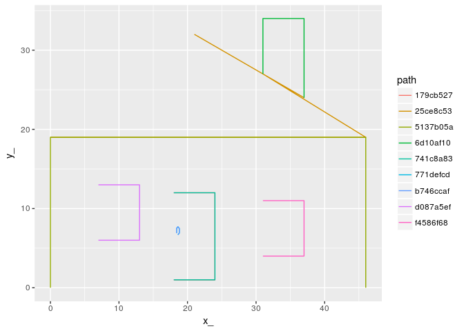

<!-- README.md is generated from README.Rmd. Please edit that file -->
[](https://travis-ci.org/mdsumner/scdb) [](https://ci.appveyor.com/project/mdsumner/scdb)

scdb
====

The goal of scdb is to provide a back-end for the sc project.

This is a general common-form data structure for complex hierarchical data.

Installation
------------

You can install scdb from github with:

``` r
# install.packages("devtools")
devtools::install_github("mdsumner/scdb")
```

Example
-------

This is a basic example which converts a simple features object to a database, then recreates that object in a very scaleable, flexible and extensible way.

``` r

library(scdb)
library(scsf)
#> Loading required package: sc
data(hpoly)
(pdb <- write_db(hpoly))
#> creating temp database C:\Users\michae_sum\AppData\Local\Temp\RtmpkzjybV\file11ec46162120.sqlite
#> src:  sqlite 3.11.1 [C:\Users\michae_sum\AppData\Local\Temp\RtmpkzjybV\file11ec46162120.sqlite]
#> tbls: object, path, path_link_vertex, sqlite_stat1, vertex
```

Now explore the objects available in the database.

``` r
library(dplyr)
#> 
#> Attaching package: 'dplyr'
#> The following objects are masked from 'package:stats':
#> 
#>     filter, lag
#> The following objects are masked from 'package:base':
#> 
#>     intersect, setdiff, setequal, union
(obj <- tbl(pdb, "object"))
#> Source:   query [?? x 3]
#> Database: sqlite 3.11.1 [C:\Users\michae_sum\AppData\Local\Temp\RtmpkzjybV\file11ec46162120.sqlite]
#> 
#>   rownumber_ feature  object_
#>        <int>   <chr>    <chr>
#> 1          1    wall d1940a76
#> 2          2    roof 30ce090b
#> 3          3    door 3c41636c
```

There are three objects, and each has a long ID `object_`, as well as other metadata.

Using joins we can access the other data in the decomposed tables.

``` r
(p <- tbl(pdb, "vertex") %>% inner_join(tbl(pdb, "path_link_vertex")) %>% inner_join(tbl(pdb, "path"))) 
#> Joining, by = "vertex_"
#> Joining, by = "path_"
#> Source:   query [?? x 7]
#> Database: sqlite 3.11.1 [C:\Users\michae_sum\AppData\Local\Temp\RtmpkzjybV\file11ec46162120.sqlite]
#> 
#>       x_    y_  vertex_    path_ island_ ncoords_  object_
#>    <dbl> <dbl>    <chr>    <chr>   <chr>    <int>    <chr>
#> 1      0     0 0d8dc0eb a28b36c6       1        5 d1940a76
#> 2      0     0 0d8dc0eb a28b36c6       1        5 d1940a76
#> 3      0    19 19617ffa a28b36c6       1        5 d1940a76
#> 4      0    19 19617ffa 9ca7a769       1        6 30ce090b
#> 5      0    19 19617ffa 9ca7a769       1        6 30ce090b
#> 6     46    19 9ca5e660 a28b36c6       1        5 d1940a76
#> 7     46    19 9ca5e660 9ca7a769       1        6 30ce090b
#> 8     46     0 c12b9287 a28b36c6       1        5 d1940a76
#> 9      7     6 2afca481 fa7476fb       1        5 d1940a76
#> 10     7     6 2afca481 fa7476fb       1        5 d1940a76
#> # ... with more rows
```

In a real case we would wrap the chained joins within a list-column in `obj` or similar trick, and use the database more cleverly to only expand out the data we need for each object. But also note there's no `collect` statement, `big_tab` is still a promise that the database will do the work only when we really need it to.

``` r
library(ggplot2)
collect(p) %>% ggplot(aes(x = x_, y = y_, group = path_, colour = path_)) + 
  geom_path()
```


